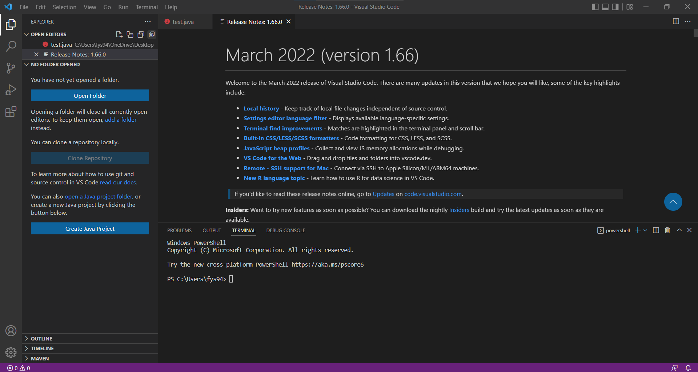
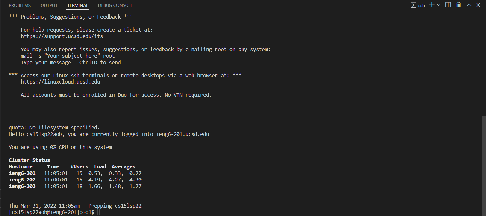
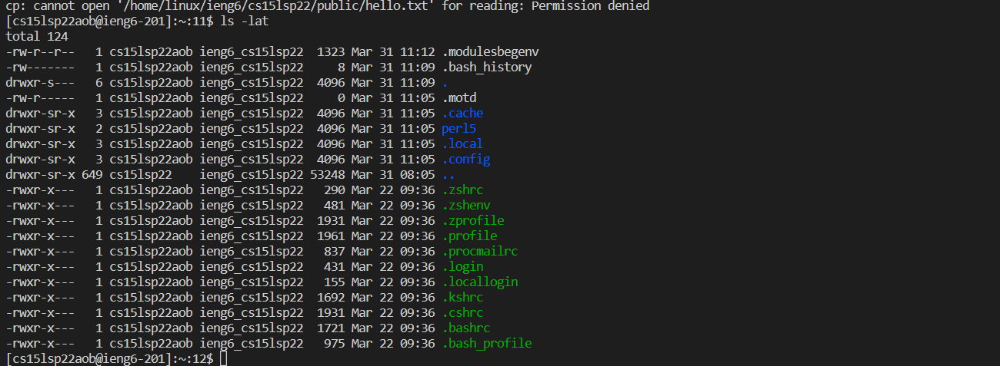
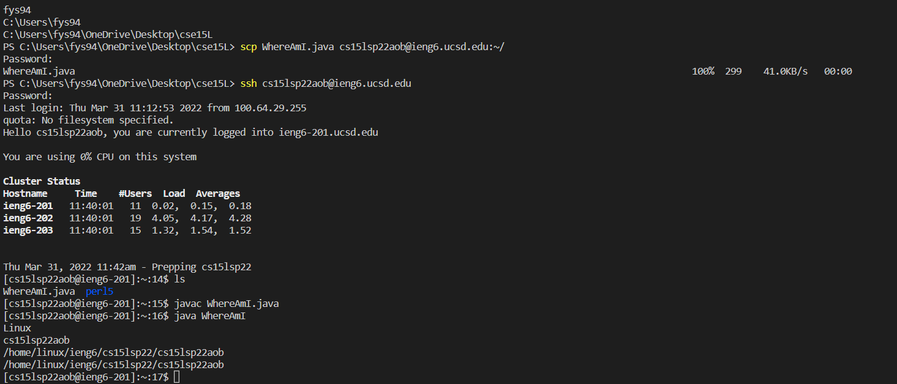

# Lab report 1 (Week 2)
1.The **first and important** step is to download and install VScode on your computer. After you install it successfully, you will see the view as below. 


2. [OpenSSH](https://docs.microsoft.com/en-us/windows-server/administration/openssh/openssh_install_firstuse
) Using the **OpenSSH** link to download the SSH remote system.

3. [CreateOwnStudentAccount](https://sdacs.ucsd.edu/~icc/index.php) Using the **CreateOwnStudentAccount** to create your own CSE15L account

4. Open VScode's terminal, using keyword *ssh cs15lsp22zz@ieng6.ucsd.edu* and enter password to enter the remote server. After you successfully log in, you will see the view listed below


5. After successfully logging in, we can try out some commands(cd ~, cd, ls -lat, ls -a). The try of **ls -lat** will have the view shown below. The **ls -lat** displays the information of the hidden files. 


6. In order to try to move files from the client (own computer) to the server, we should create a file called *WhereAmI.java* and write down some runnable codes in it. Then, type *scp WhereAmI.java cs15lsp22zz@ieng6.ucsd.edu:~/*. The terminal will require you to enter the password. After successfully logging in, using **ls** keyword to check if the file is moved from the client to your home directory. The successful action will lead to the following view. 

7. Next, we are going to generate the public and private keys for the sake of saving time without entering password when logging in. Before generating SSH keywords, we need to make sure that we exit the server and are on own computers. First, type *ssh-keygen* in the terminal. Second, we need to specify where we are going to save the key. Third, simply hitting **ENTER** for the *Enter passphrase* part. 

8. Since I am a Windows user, I need to go one more step further to set up the keys--[ssh-add](https://docs.microsoft.com/en-us/windows-server/administration/openssh/openssh_keymanagement#user-key-generation). Entering the following commands in the terminals is required. 
```
# code block
Get-Service ssh-agent | Set-Service -StartupType Manual
Start-Service ssh-agent
Get-Service ssh-agent
ssh-add ~<place where to store the keys>
```

9. We are going to copy the **public key** to the home directory of your account. First, we need to sign in to the server by entering **ssh cs15lsp22zz@ieng6.ucsd.edu**. Once signing in, enter **mkdir .ssh** in the terminal. Then, we need to enter **<logout>**. Last, we need to enter **scp /Users/<user-name>/.ssh/id_rsa.pub cs15lsp22zz@ieng6.ucsd.edu:~/.ssh/authorized_keys** in the terminal. After following those steps, you are able to log into server without entering the password. The view is shown below. 

10. 