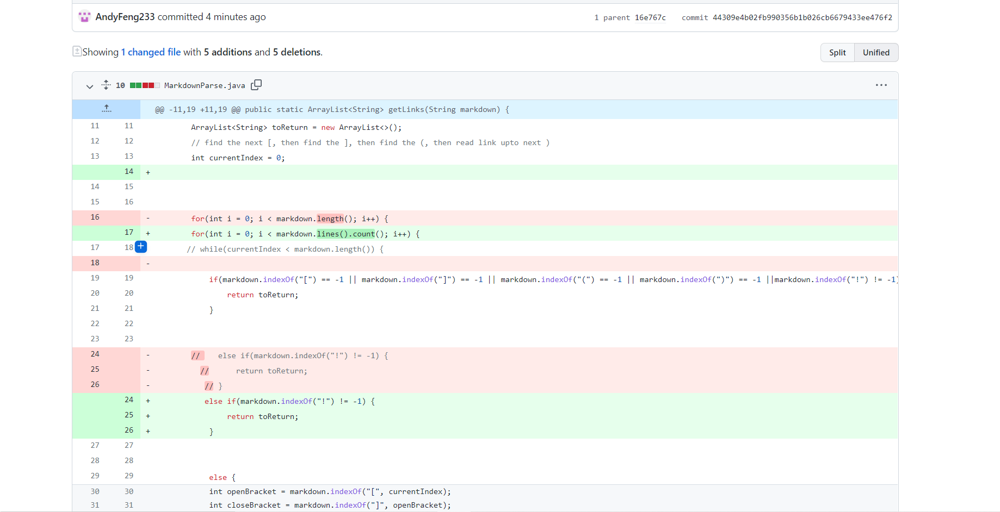
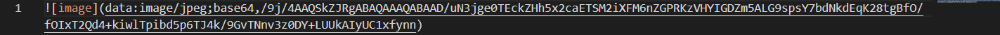
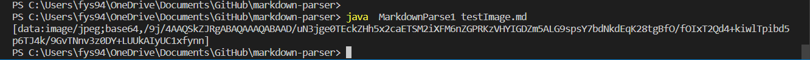

# Lab report 2 (week 4)

## Purpose: Change the codes to improve program 

## Screenshot of the code change different from Github

These are the changes that I made to improve the program. 

## Links to the failure-inducing test files
To test the program, I created four different test files.
1. Originally, the test file has a few empty lines at the end of the test file, which causes the program to crush. After deleting the empty lines, the program gives the correct outputs. Basically, the file tests if the program will run and return an  expected output of link. [Failure-inducingTestFiles](https://github.com/AndyFeng233/markdown-parser/blob/main/test-file.md)

2. The test file is going to test if the program will return multiple expected link without returning the flaw ones. [TestMultipleLink](https://github.com/AndyFeng233/markdown-parser/blob/main/test-file1.md)

3. The test file checks if the program will return the unexpected link as an outpu. [TestSingleFlawLink](https://github.com/AndyFeng233/markdown-parser/blob/main/testfile2.md)

4. The test file aims to test if the program will return the image link. [ImageTest](https://github.com/AndyFeng233/markdown-parser/blob/main/testImage.md)

## Show the symptom of that failure-inducing input by showing the output of running the file at the command line for the version where it was failing

1. The failure-inducing input is a website link without correct format. The failure-inducing input is shown below . The sympton is the return of the link, which is not what we expect to happen. In order to fix the bug, I 

2.

3. The failure-inducing input is a link to the image which has **!** in front of the **[**. The image link is shown below . The symptom is the return of the image link, which is not what we expect. The screenshot of the symptom is shown below. . In order to fix the bug that causes the symptom, I write `else if(markdown.indexOf("!") != -1) {
                return toReturn;
            }`.

## Relationship between the bug, the symptom, and the failure-inducing input

  **Bug** is a flaw in the coding which can cause none or multiple symptoms. **Symptom** is the defected problem that we can see in the terminal, such as wrong output and infinite loop. The **failure-inducing output** aims to trigger the bugs in the codes to produce symptoms. 