# Lab report 3 (week 6)

## Streamlining ssh Configuration

1. 
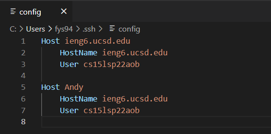
 I opened my `.ssh/config` file in the VScode by typing `.ssh/config` in the terminal. It directed me to the file. 

2.
 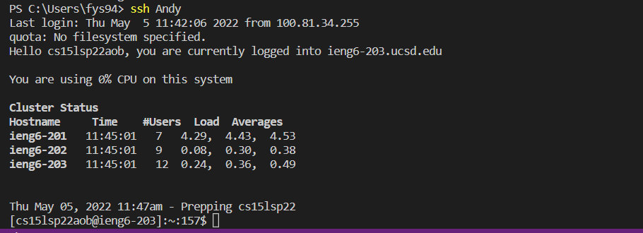
In order to log into the server with my chosen alias, I replaced the **ieng6** after the **Host** with chosen name--**Andy**. Then, I typed `ssh Andy` in the terminal and successfully logged in. 

3.
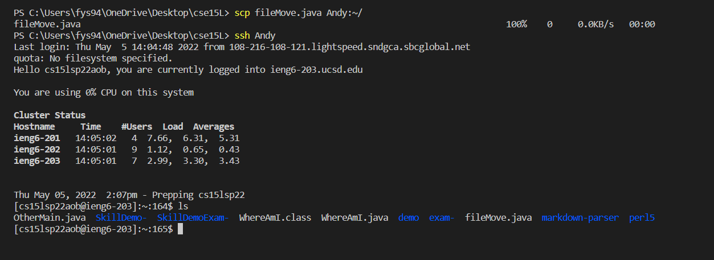
I created a file named **fileMove** locally on my laptop. In the local terminal, I typed `scp fileMove.java Andy:~/`. I logged into my virtual server by entering `ssh Andy`. Then, in order to check if the file was moved successfully from the local to the server, I typed `ls` in the terminal. The successful result is shown above. 

## Setup Github Access from ieng6
1. 
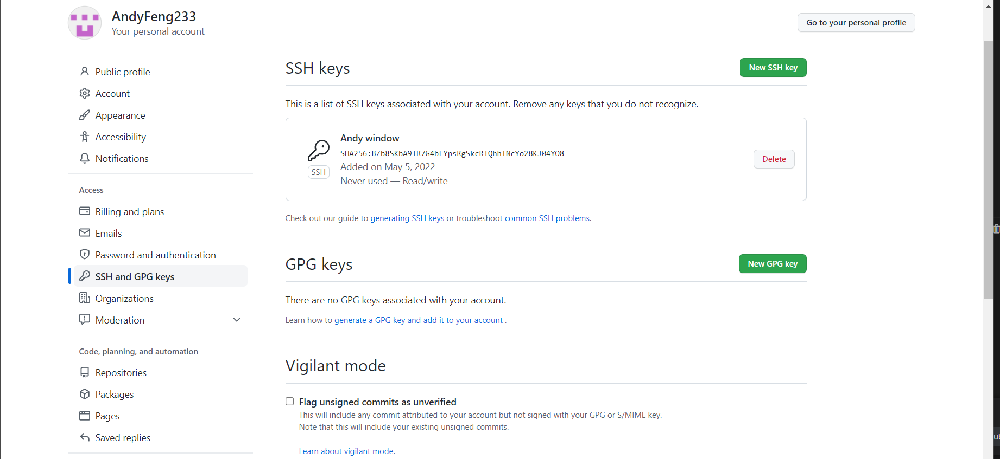
To find the **public SSH Key** on Github, I click on my icon and go to settings. Then, I click the **SSH and GPG keys**. 
   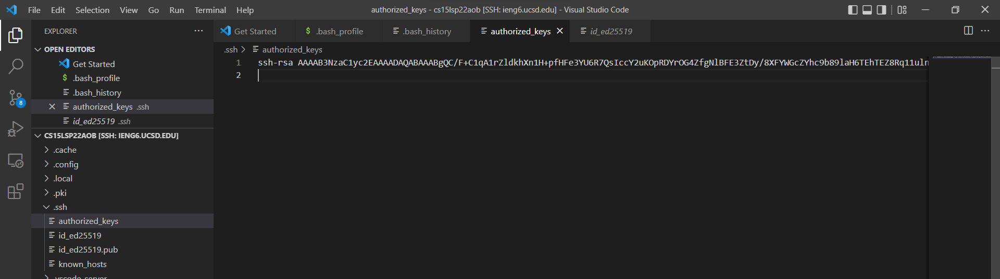
To find the **public SSH Key** on my user account, I open my ssh file. The public key is located in the **authorized_keys**.

2.
 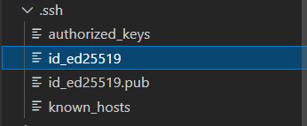

The private key is located in the **id_ed25519** which is in the **.ssh** file.

3. 

   To commit the change onto Github via my server, I type `git add MarkdownParse.java`. Then, I type `git commit -m "MarkdownParse change". To push the change onto Github via my server, I type `git push`. The image above is what the terminal shows after pushing. 

4. The link for the resulting commit is [link](https://github.com/AndyFeng233/markdown-parser)

## Copy whole directories with `scp -r`

1. 
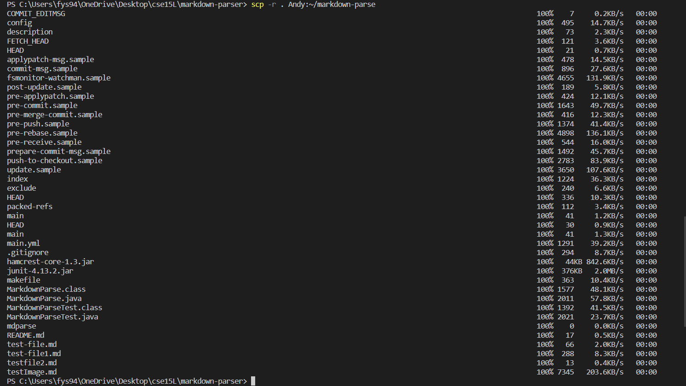
I copy the whole **markdown-parse** directory to my server by typing `scp -r . Andy:~/markdown-parse` in the terminal. 

2. 
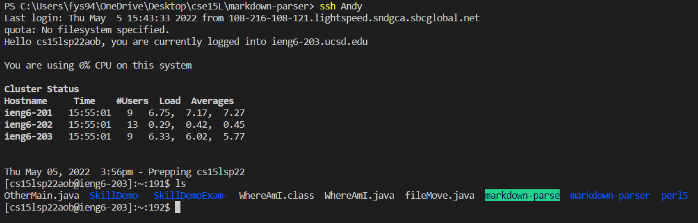
After logging in and use `ls` to check the contents of my server, the directory markdown-parse is highlighted in green. 

3. 
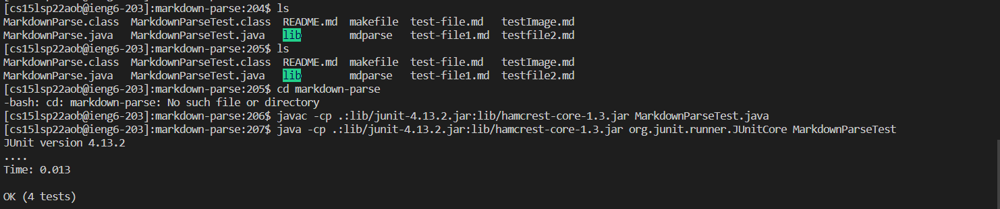
In my server account, first type `cd markdown-parse` to change the directory to the markdown-parse. I compile the **MarkdownParseTest.java** by entering `javac -cp .:lib/junit-4.13.2.jar:lib/hamcrest-core-1.3.jar MarkdownParseTest.java` in the terminal. Then, I run the test by entering `java -cp .:lib/junit-4.13.2.jar:lib/hamcrest-core-1.3.jar org.junit.runner.JUnitCore MarkdownParseTest`. The result is shown in the screenshot above. 

4. 
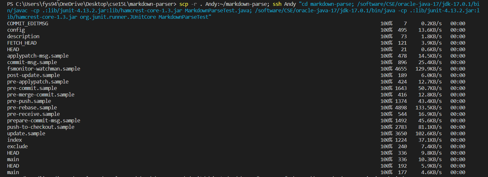
To combining `scp`, `;`, and `ssh` to copy the whole directory and run the tests in one line, I type `scp -r . cs15lsp22aob@ieng6.ucsd.edu:~/markdown-parse; ssh ieng6 "cd markdown-parse; /software/CSE/oracle-java-17/jdk-17.0.1/bin/javac -cp .:lib/junit-4.13.2.jar:lib/hamcrest-core-1.3.jar MarkdownParseTest.java; /software/CSE/oracle-java-17/jdk-17.0.1/bin/java -cp .:lib/junit-4.13.2.jar:lib/hamcrest-core-1.3.jar org.junit.runner.JUnitCore MarkdownParseTest"` in the terminal. The result is shown below. 
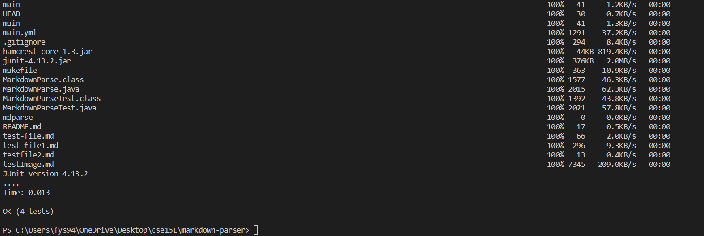

