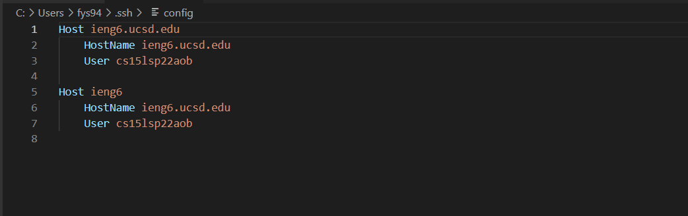
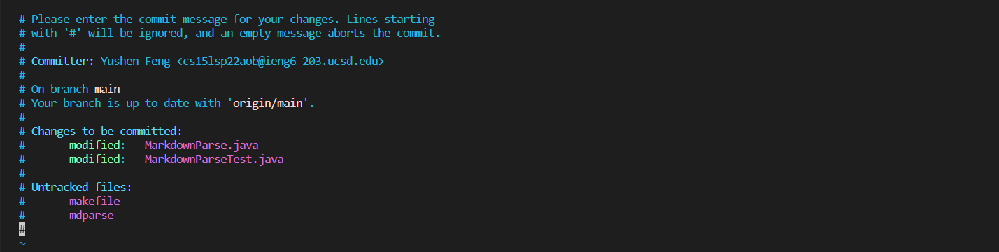

# Lab report 3 (week 6)

## Streamlining ssh Configuration

1. 
 I opened my `.ssh/config` file in the VScode by typing `.ssh/config` in the terminal. It directed me to the file. 

2. 
In order to log into the server with my chosen alias, I replaced the **ieng6** after the **Host** with chosen name--**Andy**. Then, I typed `ssh Andy` in the terminal and successfully logged in. 

3.
I created a file named **fileMove** locally on my laptop. In the local terminal, I typed `scp fileMove.java Andy:~/`. I logged into my virtual server by entering `ssh Andy`. Then, in order to check if the file was moved successfully from the local to the server, I typed `ls` in the terminal. The successful result is shown above. 

## Setup Github Access from ieng6
1. 
To find the **public SSH Key** on Github, I click on my icon and go to settings. Then, I click the **SSH and GPG keys**. 
   
To find the **public SSH Key** on my user account, I open my ssh file. The public key is located in the **authorized_keys**.

2. 
The private key is located in the **id_ed25519** which is in the **.ssh** file.

3. 
   
   To commit the change onto Github via my server, I type `git commit`. The first image is what the terminal shows after commiting. To push the change onto Github via my server, I type `git push`. The second image above is what the terminal shows after pushing. 

4. The link for the resulting commit is **https://github.com/AndyFeng233/markdown-parser**

## Copy whole directories with `scp -r`

