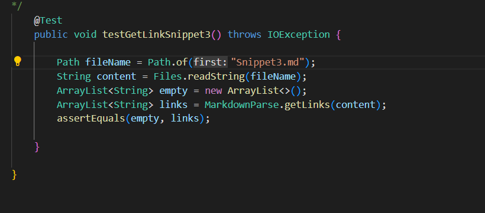

# Lab report 3 (week 6)

## Run tests on my Markdown-parse

## Snippet1
The preview for link is shown here:

The test I write for testing snippet1 is shown below. 

The result of running the test on my own markdown-parse is shown below. 

The test didn't pass

## Snippet2
The preview for link is shown here: 

The test I write for testing snippet2 is shown below. 

The result of running the test on my own markdown-parse is shown below. 

The test didn't pass

## Snippet3
The preview for the link is shown here. 

The test I write for testing snippet2 is shown below. 

The result of running the test on my own markdown-parse is shown below. 

The test didn't pass

## Run tests on the assigned account

The link to the repo: [Review](https://github.com/Wei-Ji-Chen/markdown-parser)

## Snippet1
The preview for link is shown here:

The test I write for testing snippet1 is shown below. 

The result of running the test on my own markdown-parse is shown below.

The test didn't pass

## Snippet2
The preview for link is shown here: 

The test I write for testing snippet2 is shown below. 

The result of running the test on my own markdown-parse is shown below. 

The test didn't pass

## Snippet3
The preview for the link is shown here. 

The test I write for testing snippet2 is shown below. 

The result of running the test on my own markdown-parse is shown below. 

The test didn't pass'

## Question 1 
## Do you think there is a small (<10 lines) code change that will make your program work for snippet 1 and all related cases that use inline code with backticks? If yes, describe the code change. If not, describe why it would be a more involved change.

## Answer 
Small code change can make my program work for snippet 1. I am going to write some if-else statemnts to detect if the link is in the correct format. For example, I will check if there is a symbol in front of `[` or if there is an extra `[` or `]` inside the `[]`.

## Question 2
## Do you think there is a small (<10 lines) code change that will make your program work for snippet 2 and all related cases that nest parentheses, brackets, and escaped brackets? If yes, describe the code change. If not, describe why it would be a more involved change.

## Ans
Small code change will make my program work for snippet 2. It is because I only need a for-loop and an if statement which is inside the for-loop to check if there are nest parentheses, brackets, and escaped brackets.

## Question 3
## Do you think there is a small (<10 lines) code change that will make your program work for snippet 3 and all related cases that have newlines in brackets and parentheses? If yes, describe the code change. If not, describe why it would be a more involved change.

## Ans
Small code change will probably not make my program work for snippet 3. It is because I need to write some for-loops to detect if there is space in between lines inside the `[]`. Also, if the link is in the correct format but with space inside the `[]` part, I need to write some codes to deal with that part and decide if it will return the link. 

