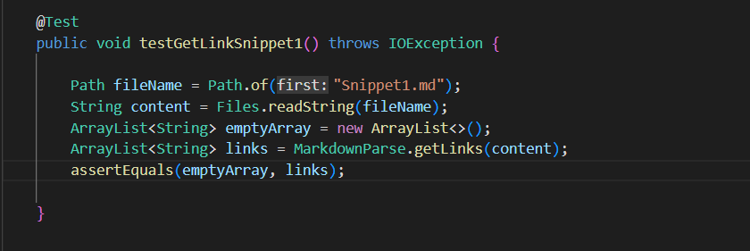
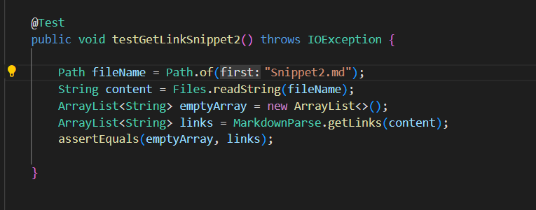

# Lab report 3 (week 6)

## Run tests on my Markdown-parse

## Snippet1
The test I write for testing snippet1 is shown below. 

The result of running the test on my own markdown-parse is shown below. 

## Snippet2
The test I write for testing snippet2 is shown below. 

The result of running the test on my own markdown-parse is shown below. 

## Snippet3
The test I write for testing snippet2 is shown below. 

The result of running the test on my own markdown-parse is shown below. 

## Run tests on the assigned account

The link to the repo: [Review](https://github.com/Wei-Ji-Chen/markdown-parser)

## Snippet1
The test I write for testing snippet1 is shown below. 

The result of running the test on my own markdown-parse is shown below.

## Snippet2
The test I write for testing snippet2 is shown below. 

The result of running the test on my own markdown-parse is shown below. 

## Snippet3
The test I write for testing snippet2 is shown below. 

The result of running the test on my own markdown-parse is shown below. 

