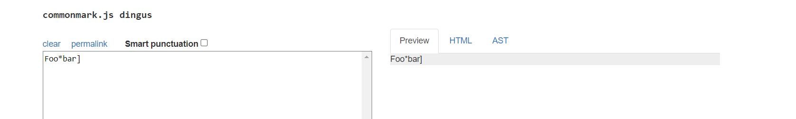
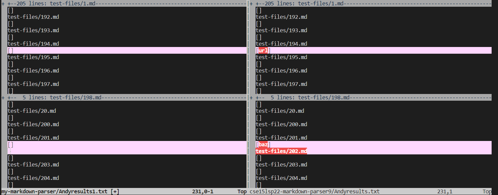
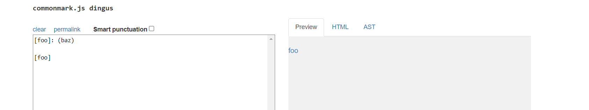

# Lab report 5 (week 10)

## Question 1: How you found the tests with different results (Did you use vimdiff on the results of running a bash for loop? Did you search through manually? Did you use some other programmatic idea?)

Answer: I found the tests with different results by using vimdiff. The vimdiff directly shows which test results are different.  

## Provide a link to the test-file with different-results (in the provided repository or your repository , either is fine)

Answer: The link to the test-files [linkToTestFiles](https://github.com/nidhidhamnani/markdown-parser/tree/main/test-files).

## For each test:
* Describe which implementation is correct, or neither if both give the wrong output
* Indicate both actual outputs (provide screenshots) and also what the expected output is (list the links that are expected in the output).
* Decide on what it should produce (i.e., expected output) by using either VScode preview or the CommonMark demo site.

Answer: 

**Test 194** :  
The expected output of test 194 based on the the CommonMark demo site is shown below. 

The actual output on vimdiff is shown below. 

The expected output should be [] for test 194. 

My own implementation (Andyresult1) has the correct output because it doesn't output any link while the implementation of the given account (Andyresult) has the wrong output because it outputs a link.

The bug of the given repository is that the code returns a wrong link in which it shouldn't produce any link. The code might have a loop that returns thing that is before or after the expected position. 

**Test 201**
The expected output of test 201 based on the the CommonMark demo site is shown below.

The actual output on vimdiff is shown below. 

The expected output should be [] for test 201.

My own implementation (Andyresult1) has the correct output because it doesn't output any link while the implementation of the given account (Andyresult) has the wrong output because it outputs a link.

The bug of the given repository is that the code returns a link where it shouldn't. The code did not recognize the absence of `(` after the `[`. So, it should add more conditions to check.  
